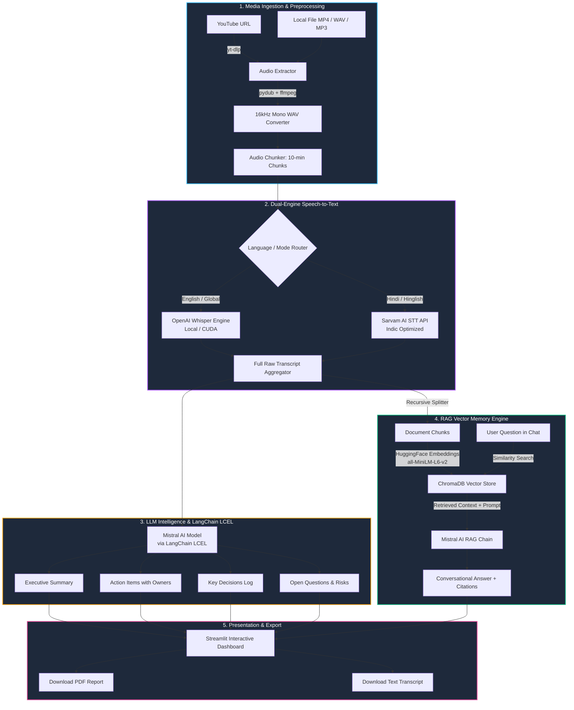
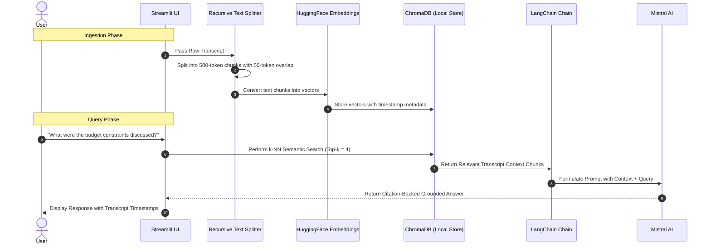

<div align="center">

# 🎙️ InsightAudio

### **Autonomous AI Meeting Assistant & Video Intelligence Platform**

*Transform meeting recordings, conversations, and YouTube videos into structured executive summaries, actionable task trackers, and conversational RAG memory — 100% self-hosted, private, and cost-free.*

<br/>

[](https://www.python.org/)
[](https://streamlit.io/)
[](https://www.langchain.com/)
[](https://ai.google.dev/)
[](https://github.com/openai/whisper)
[](https://www.trychroma.com/)
[](#)
[](LICENSE)

<br/>

[🌟 Key Features](#-key-features) •
[🏗️ Architecture](#️-system-architecture) •
[🛠️ Tech Stack](#️-technology-stack) •
[⚡ Quick Start](#-quick-start--installation) •
[⚙️ Configuration](#️-environment-configuration) •
[🖥️ UI Tour](#️-user-interface--workflow) •
[🧠 RAG Pipeline](#-retrieval-augmented-generation-rag) •
[🗺️ Roadmap](#️-roadmap)

---

</div>

<br/>

## 📌 Executive Summary

Modern knowledge workers and engineering teams spend hundreds of hours in virtual meetings, lectures, and video presentations. Existing commercial transcription tools charge steep monthly subscriptions ($20–$50/seat/month), enforce strict recording caps, compromise data privacy by sending proprietary meetings to third-party clouds, and struggle heavily with regional dialects such as **Hindi and Hinglish**.

**InsightAudio** is a free, open-source, production-ready AI Meeting Assistant engineered entirely in Python. It provides an end-to-end pipeline that ingests any YouTube video or local media file (audio/video), performs high-fidelity speech-to-text with bilingual routing (Whisper for English & Sarvam AI for Hindi/Hinglish), synthesizes comprehensive structured intelligence using **Google Gemini**, indexes embeddings in ChromaDB, and delivers an interactive Streamlit dashboard with a citation-backed conversational RAG chat engine.

---

## 🌟 Key Features

```
               ┌────────────────────────────────────────────────────────┐
               │              🎙️ INSIGHTAUDIO CAPABILITIES              │
               └────────────────────────────────────────────────────────┘
               │                                                        │
               ├─► 📺 Universal Media Ingestion (YouTube & Local Media) │
               ├─► 🎙️ Dual STT Engine (Whisper Local + Sarvam AI Indic) │
               ├─► ⚡ Intelligent 16kHz Audio Normalization & Chunking  │
               ├─► 🧠 Deep Meeting Intelligence (Actions, Decisions)   │
               ├─► 💬 Interactive RAG Conversational Memory (ChromaDB)  │
               └─► 📑 One-Click Executive PDF & Plaintext Export        │
```

### 1. 📺 Versatile Multi-Source Ingestion
* **YouTube Ingestion**: Paste any public or unlisted YouTube video URL. Stream audio directly using `yt-dlp` without downloading high-bandwidth video streams.
* **Local Media Support**: Drag-and-drop support for all major audio and video containers: `.mp4`, `.mov`, `.mkv`, `.mp3`, `.wav`, `.m4a`, `.webm`, `.flac`, and `.aac`.
* **Smart Audio Conversion**: Automatically downmixes multi-channel audio to single-channel 16kHz WAV format (the optimal input format for speech models) via `pydub` and `ffmpeg`.

### 2. 🎙️ State-of-the-Art Dual STT Engine
* **Local OpenAI Whisper Engine**: Runs 100% locally and offline on CPU or GPU (CUDA). Zero API costs, zero data egress, and complete privacy for English and global languages.
* **Sarvam AI Engine (Indic & Hinglish)**: Direct integration with Sarvam AI's speech API, specialized in accurately capturing Indian accents, native Hindi speech, and code-mixed *Hinglish* vocabulary with high accuracy.
* **Automated Audio Chunking**: Automatically splits long audio tracks into time-bounded chunks (e.g., 10-minute blocks) to avoid memory overflows and API size limits.

### 3. 🧠 Deep Meeting Intelligence & Analysis
* **Executive Summary**: Generates structured, high-impact TL;DR bullet points summarizing core topics and themes.
* **Action Items Extraction**: Extracts actionable deliverables, complete with **Owners / Assignees**, **Priority**, and **Deadlines / Timelines**.
* **Key Decisions Log**: Identifies and records major organizational or architectural decisions made during the conversation.
* **Open Questions & Risks**: Highlights unanswered inquiries, blockers, and topics deferred to follow-up discussions.
* **Key Highlights & Timestamps**: Isolates critical milestones and turning points across the discussion.

### 4. 💬 RAG-Powered Conversational Q&A
* **Vectorized Knowledge Base**: Automatically segments transcripts and generates vector embeddings locally using HuggingFace's `all-MiniLM-L6-v2` (`sentence-transformers`).
* **ChromaDB Vector Store**: Persists document vectors into a fast, local ChromaDB collection for low-latency similarity search.
* **Context-Grounded Q&A**: Chat with your meeting transcripts using LangChain Expression Language (LCEL) and Mistral AI. Answers are strictly grounded in transcript evidence to eliminate hallucinations.

### 5. 📑 Professional Export & Reporting
* **Executive PDF Reports**: Generates beautifully styled PDF summaries with formatted tables, action checklists, and decision summaries ready for executive distribution using `reportlab`.
* **Markdown & Plaintext Export**: One-click download of full transcripts and structured notes in standard `.txt` or `.md` formats.

---

## 🏗️ System Architecture



---

## 🛠️ Technology Stack

| Component Layer | Technology / Library | Purpose & Implementation | Tier / Cost |
| :--- | :--- | :--- | :--- |
| **Core Language** |  `3.10+` | Core application logic, multiprocessing, and orchestration | Free & Open-Source |
| **User Interface** |  `1.35+` | Responsive web dashboard, tabbed layout, chat interface | Free & Open-Source |
| **Media Ingestion** | `yt-dlp` + `ffmpeg-python` | High-speed audio extraction from YouTube & local format conversion | Free & Open-Source |
| **Audio Processing** | `pydub` | 16kHz mono normalization, chunking, and waveform manipulation | Free & Open-Source |
| **Speech-to-Text (Local)** | `openai-whisper` + `PyTorch` | Offline, zero-cost, privacy-first transcription for English/multilingual | Free & Open-Source |
| **Speech-to-Text (Indic)** | `Sarvam AI API` | Specialized transcription for Hindi and code-mixed Hinglish | Free Tier Available |
| **LLM Orchestration** | `LangChain` (LCEL) | Structured output parsing, chain composition, and prompt management | Free & Open-Source |
| **LLM Inference** | `Mistral AI` (`mistral-small-latest` / `mistral-medium`) | Summarization, action item extraction, and reasoning | Free Tier API |
| **Embedding Engine** | `sentence-transformers` (`all-MiniLM-L6-v2`) | Local 384-dimensional dense vector embeddings | Free & Open-Source |
| **Vector Database** | `ChromaDB` | Embedded vector database for persistent RAG retrieval | Free & Open-Source |
| **Report Generation** | `reportlab` & `fpdf2` | Production-grade PDF formatting with custom styles & metadata | Free & Open-Source |

---

## 🖥️ User Interface & Workflow

InsightAudio features a modern, clean Streamlit dashboard designed for intuitive interaction across four primary phases:

```
┌─────────────────────────────────────────────────────────────────────────────┐
│ 🎙️ InsightAudio — AI Meeting Intelligence Dashboard                        │
├─────────────────────────────────────────────────────────────────────────────┤
│                                                                             │
│  [ 📥 1. Ingest & Transcribe ]  [ 📊 2. Meeting Insights ]  [ 💬 3. RAG Q&A ]│
│                                                                             │
│  ┌─ Input Source Selection ──────────────────────────────────────────────┐  │
│  │ (•) YouTube URL      ( ) Upload Local File (MP4/WAV/MP3)              │  │
│  │ https://www.youtube.com/watch?v=sample-meeting-video                  │  │
│  └───────────────────────────────────────────────────────────────────────┘  │
│                                                                             │
│  ┌─ Model Configuration ─────────────────────────────────────────────────┐  │
│  │ STT Engine: [ OpenAI Whisper (Local) ▾ ]   Model Tier: [ Base (Fast) ▾]│  │
│  │ Target Language: [ Auto-Detect / English ▾ ]                           │  │
│  └───────────────────────────────────────────────────────────────────────┘  │
│                                                                             │
│  [ 🚀 Start Processing & Transcribing ]                                      │
│                                                                             │
│  ═════════════════════════════════════════════════════════════════════════  │
│  📊 Meeting Intelligence Overview                                          │
│  ┌─ Executive Summary ──────────────────┐ ┌─ Action Items Tracker ───────┐  │
│  │ • Finalized Q3 product roadmap       │ │ [ ] Refactor auth module     │  │
│  │ • Migrated backend to FastAPI micro  │ │     Assignee: @alex (by Fri) │  │
│  │ • Approved cloud cost budget for AI  │ │ [ ] Update API docs for RAG  │  │
│  └──────────────────────────────────────┘ └──────────────────────────────┘  │
│                                                                             │
│  💬 Chat with Meeting Transcript (RAG)                                      │
│  ┌───────────────────────────────────────────────────────────────────────┐  │
│  │ 👤 User: What was the decision regarding the database migration?     │  │
│  │ 🤖 AI: The team agreed to proceed with PostgreSQL for relational data │  │
│  │        and ChromaDB for vector embeddings by Friday. (Chunk #2, 14:20)│  │
│  └───────────────────────────────────────────────────────────────────────┘  │
│  [ Type your question about the meeting...                              ]   │
│                                                                             │
│  [ 📥 Download PDF Summary ]        [ 📄 Export Full Transcript (.txt) ]     │
└─────────────────────────────────────────────────────────────────────────────┘
```

---

## ⚡ Quick Start & Installation

### Prerequisites

* **Python**: Python `>= 3.10` installed on your system ([Download Python](https://www.python.org/downloads/)).
* **FFmpeg**: Required for audio format conversion and chunking.

#### Installing FFmpeg

<details>
<summary><b>Windows (via Scoop / Chocolatey / Winget)</b></summary>

```powershell
# Using Winget (Recommended)
winget install Gyan.FFmpeg

# Or using Chocolatey
choco install ffmpeg

# Or using Scoop
scoop install ffmpeg
```
</details>

<details>
<summary><b>macOS (via Homebrew)</b></summary>

```bash
brew install ffmpeg
```
</details>

<details>
<summary><b>Linux (Ubuntu / Debian)</b></summary>

```bash
sudo apt update && sudo apt install -y ffmpeg
```
</details>

---

### Step 1: Clone Repository & Enter Directory

```bash
git clone https://github.com/ggauravky/InsightAudio.git
cd InsightAudio
```

### Step 2: Create & Activate Virtual Environment

```bash
# Windows (PowerShell)
python -m venv venv
.\venv\Scripts\Activate.ps1

# macOS / Linux
python3 -m venv venv
source venv/bin/activate
```

### Step 3: Install Dependencies

```bash
pip install --upgrade pip
pip install -r requirements.txt
```

> **Note on PyTorch & CUDA (GPU Acceleration)**:
> If you have an NVIDIA GPU and want blazing-fast Whisper transcription, install PyTorch with CUDA support:
> ```bash
> pip install torch torchaudio --index-url https://download.pytorch.org/whl/cu121
> ```

---

## ⚙️ Environment Configuration

InsightAudio utilizes `.env` to manage credentials securely.

1. Copy the example configuration template:
   ```bash
   cp .env.example .env
   ```
2. Open `.env` in your editor and provide your API keys:

```ini
# ==============================================================================
# InsightAudio - Environment Configuration
# ==============================================================================

# Mistral AI API Key (Required for Summarization, Extraction, & RAG)
# Get a free key at: https://console.mistral.ai/
MISTRAL_API_KEY="your_mistral_api_key_here"

# Sarvam AI API Key (Optional: Required only for Hindi/Hinglish STT mode)
# Get a key at: https://www.sarvam.ai/
SARVAM_API_KEY="your_sarvam_api_key_here"

# Whisper Local Model Size: 'tiny', 'base', 'small', 'medium', 'large-v3'
WHISPER_MODEL_SIZE="base"

# Vector DB & Storage Paths
CHROMA_DB_DIR="./data/chromadb"
DOWNLOAD_DIR="./downloads"
EXPORT_DIR="./exports"
```

---

## 🚀 Running the Application

Launch the Streamlit interface with:

```bash
streamlit run app.py
```

The application will launch in your default web browser at:
`http://localhost:8501`

---

## 🧠 Retrieval-Augmented Generation (RAG)

InsightAudio implements an advanced, self-contained RAG pipeline that transforms raw audio transcripts into an interactive vector memory store:



---

## 📁 Project Directory Structure

```plaintext
InsightAudio/
├── 📄 app.py                  # Main Streamlit application dashboard & navigation
├── 📄 requirements.txt        # Production dependency specifications
├── 📄 .env.example            # Environment configuration template
├── 📄 .env                    # Local secrets & API keys (git-ignored)
├── 📄 .gitignore              # Git ignore rules for virtualenv, downloads, & db
├── 📄 README.md               # Comprehensive project documentation
│
├── 📂 utils/                  # Core modular utility packages
│   ├── 🐍 audioProcessor.py   # YouTube downloader (yt-dlp), converter & chunker
│   ├── 🐍 transcription.py    # OpenAI Whisper & Sarvam AI STT orchestrator
│   ├── 🐍 summarizer.py       # LangChain LCEL chains for meeting intelligence
│   ├── 🐍 rag_engine.py       # ChromaDB vector store & semantic search chains
│   └── 🐍 exporter.py         # PDF (ReportLab) and TXT report generation
│
├── 📂 downloads/              # Temporary audio extraction buffer (git-ignored)
├── 📂 exports/                # Generated PDF and TXT executive reports
└── 📂 data/
    └── 📂 chromadb/           # Persistent local vector embeddings store
```

---

## 📊 Benchmarks & Resource Sizing

Whisper model selection allows you to balance speed, memory, and transcription accuracy:

| Whisper Model | Parameters | VRAM (GPU) | RAM (CPU) | Relative Speed | Recommended Use Case |
| :--- | :--- | :--- | :--- | :--- | :--- |
| **`tiny`** | 39 M | ~1 GB | ~1.5 GB | ~32x | Rapid prototyping & short audio clips |
| **`base`** *(Default)* | 74 M | ~1.5 GB | ~2 GB | ~16x | Fast, balanced day-to-day meetings |
| **`small`** | 244 M | ~2.5 GB | ~3.5 GB | ~6x | High accuracy for technical discussions |
| **`medium`** | 769 M | ~5 GB | ~6 GB | ~2x | Multi-speaker accents & noisy audio |
| **`large-v3`** | 1550 M | ~10 GB | ~12 GB | 1x | Maximum fidelity & complex jargon |

---

## 🗺️ Roadmap & Upcoming Features

- [x] Universal YouTube & Local media ingestion
- [x] Dual-engine STT (Local OpenAI Whisper + Sarvam AI Indic API)
- [x] Automated audio normalization and smart chunking
- [x] LangChain LCEL summarization & structured extraction
- [x] ChromaDB RAG vector conversational Q&A
- [x] PDF & Plaintext report exports
- [ ] **Speaker Diarization**: Multi-speaker identification with `PyAnnote.audio` (Who spoke when).
- [ ] **Real-time Live Audio Capture**: Virtual microphone bridge for live Zoom / Google Meet recording.
- [ ] **Webhook Integrations**: Auto-export action items to Notion databases, Jira tickets, or Slack channels.
- [ ] **Custom Meeting Templates**: Specialized templates for 1-on-1s, Engineering Standups, Sprint Retrospectives, and Board Meetings.

---

## 🤝 Contributing

Contributions make the open-source community an incredible place to learn, inspire, and create. Any contributions you make are **greatly appreciated**!

1. **Fork the Project**
2. **Create your Feature Branch** (`git checkout -b feature/AmazingFeature`)
3. **Commit your Changes** (`git commit -m 'feat: Add AmazingFeature'`)
4. **Push to the Branch** (`git push origin feature/AmazingFeature`)
5. **Open a Pull Request**

---

## 📄 License & Acknowledgments

This project is licensed under the **MIT License** — see the [LICENSE](LICENSE) file for details.

### Acknowledgments & Built With
* [OpenAI Whisper](https://github.com/openai/whisper) — Robust Speech Recognition
* [Sarvam AI](https://www.sarvam.ai/) — Pioneering Indic language models
* [Mistral AI](https://mistral.ai/) — Open and efficient frontier LLMs
* [LangChain](https://www.langchain.com/) — Framework for LLM applications
* [ChromaDB](https://www.trychroma.com/) — The AI-native open-source embedding database
* [Streamlit](https://streamlit.io/) — The fastest way to build and share data apps
* [yt-dlp](https://github.com/yt-dlp/yt-dlp) — Feature-rich audio/video extractor

---

<div align="center">

**Built with ❤️ for productive teams and open-source enthusiasts.**

⭐ **Star this repository if you find InsightAudio helpful!** ⭐

</div>
